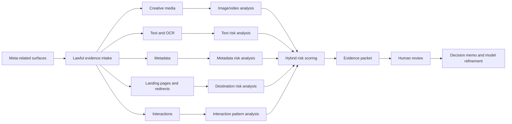
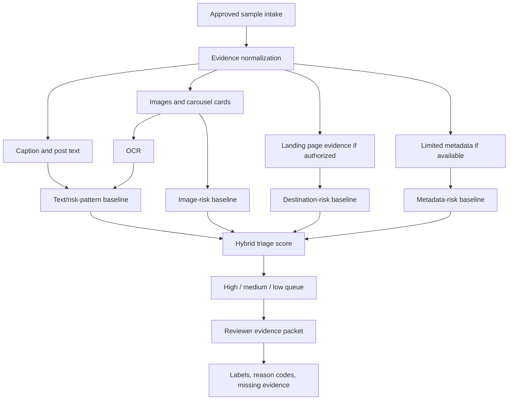
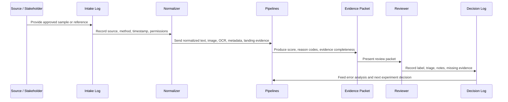
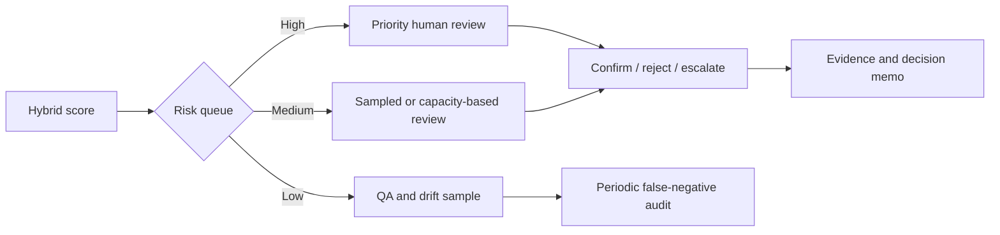

# System Concepts

## Broad Concept

The broad architecture maps all possible evidence layers. It is intentionally larger than the budget-fit prototype so stakeholders can see what is being deferred.

## Narrowed Architecture

The budget-fit architecture removes long video, Stories, broad comment collection, graph analysis, and definitive deepfake detection from the first prototype.

## Recommended Prototype Architecture

Inputs:

- `case_id`
- image or carousel image-set
- caption/post text
- OCR text
- landing URL and landing-page text/screenshot if authorized
- limited metadata fields if available

Processing:

- text normalization
- OCR extraction
- rule and keyword/risk-pattern baseline
- text model baseline
- image embedding/classifier baseline
- optional VLM-assisted reason generation on sample or high-risk queue
- hybrid score aggregation
- evidence packet generation

Outputs:

- risk level: high/medium/low
- primary label suggestion
- reason codes
- evidence completeness score
- reviewer note and final label

## Evidence Flow

## Review Flow

## Design Choices

- Keep the prototype evidence-centric. A reviewer should understand why a case was flagged.
- Keep ingestion lawful and auditable.
- Treat VLM/LLM outputs as assistive evidence summaries, not final truth.
- Keep landing-page analysis gated by legal approval and security precautions.
- Use high-risk precision as the first optimization target.

## Future Scaled Architecture

Only a future, separately funded program should consider:

- continuous ingestion
- workflow dashboard
- investigator case management
- model monitoring
- deepfake benchmark service
- domain/advertiser cluster analysis
- platform partnership/API integration
